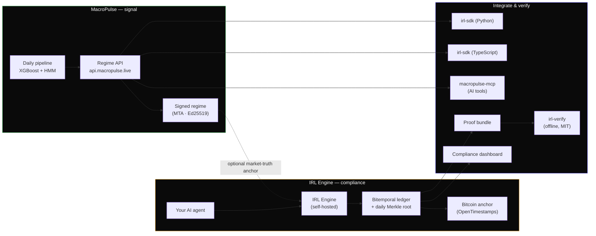

<picture>
  <source media="(prefers-color-scheme: dark)" srcset="brand/logo-mono.svg">
  
</picture>

# MacroPulse

**Know the macro regime before the market does — and prove every decision your agents make.**

Two products, one platform. A daily macro-regime signal for quant teams, and a cryptographic
pre-execution compliance layer for autonomous trading agents.

[Website](https://macropulse.live) · [API Docs](https://macropulse.live/api-docs) · [IRL Engine](https://macropulse.live/irl) · [Track Record](https://macropulse.live/track-record) · [Live Sandbox](https://irl.macropulse.live)

---

## The two products

### 🟢 MacroPulse — Macro Regime API
A daily macro-regime classification for US markets: four regimes (**Expansion · Recovery · Tightening · Risk-Off**)
derived from Fed liquidity, credit spreads, volatility, and the yield curve, served over a REST API and signed
with Ed25519 so every reading is independently verifiable. Free tier, then Starter and Pro.

→ Start at [macropulse.live](https://macropulse.live) · `pip install macropulse-mcp` to use it inside any AI agent.

### 🟡 IRL Engine — Immutable Reasoning Log
A pre-execution compliance gateway that sits between an AI trading agent and the exchange. Before any order is
placed, the agent's reasoning is cryptographically sealed (SHA-256 / RFC 8785), written to a bitemporal ledger,
and anchored daily to Bitcoin via OpenTimestamps — producing a tamper-evident audit trail that **anyone can
verify offline, without trusting us.**

→ Try the [live sandbox](https://irl.macropulse.live) (no signup) · read the [protocol spec](https://github.com/GabrielGauss/irl-public-docs).

---

## How it fits together

---

## Repository index

| Repo | What it is | Stack | Ships to |
|------|-----------|-------|----------|
| **[macropulse](https://github.com/GabrielGauss/macropulse)** 🔒 | Core: regime pipeline, REST API, dashboard, marketing site | Python / React | VPS · Vercel |
| **[IRL-engine-AX](https://github.com/GabrielGauss/IRL-engine-AX)** | IRL Engine — pre-execution compliance gateway (public source) | Rust | self-host |
| **[irl-public-docs](https://github.com/GabrielGauss/irl-public-docs)** | IRL protocol spec, whitepaper, integration & compliance guides | Markdown | — |
| **[irl-sdk-python](https://github.com/GabrielGauss/irl-sdk-python)** | IRL client SDK for Python | Python | PyPI · `irl-sdk` |
| **[irl-sdk-ts](https://github.com/GabrielGauss/irl-sdk-ts)** | IRL client SDK for TypeScript | TypeScript | npm · `irl-sdk` |
| **[irl-verify](https://github.com/GabrielGauss/irl-verify)** | Offline proof-bundle verifier — frozen spec, MIT | Rust | crates.io |
| **[irl-dashboard](https://github.com/GabrielGauss/irl-dashboard)** | Read-only compliance console for an IRL Engine | TypeScript | Vercel |
| **[macropulse-mcp](https://github.com/GabrielGauss/macropulse-mcp)** | MCP server — the regime signal as native AI-agent tools | Python | PyPI · `macropulse-mcp` |

🔒 = private source.

---

## Pick your path

**I want the macro regime signal** → get a free key at [macropulse.live](https://macropulse.live), or drop it into
your AI assistant with `pip install macropulse-mcp`.

**I want my trading agent to be auditable** → run the [sandbox](https://irl.macropulse.live), then self-host the
[engine](https://github.com/GabrielGauss/IRL-engine-AX) and wrap your agent with `pip install irl-sdk`.

**I need to verify someone's proof** → you never need an account. Clone
[irl-verify](https://github.com/GabrielGauss/irl-verify) and check any proof bundle offline, or use the
in-browser [explorer](https://macropulse.live/proof).

---

## Brand

Canonical logo and colors live in [`brand/`](brand/). The mark is a phase-offset striped sphere —
the interference seam represents a regime transition. Primary green `#3fb85a`; on dark surfaces use the
mono (white) variant.

&nbsp;&nbsp;&nbsp;

---

© 2026 MacroPulse · <a href="https://macropulse.live">macropulse.live</a> · licensing@macropulse.live

